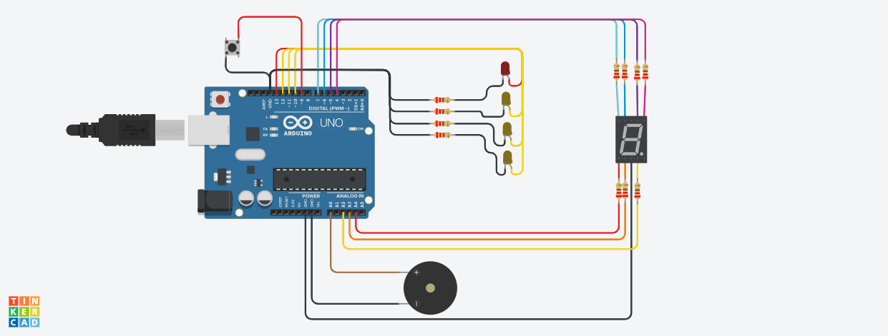
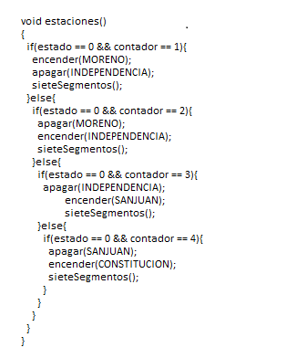

# Integrantes

- Barbizan	Franco
- García	Angeles Belen 
- Dopiralski	martin
- Costantini	Nicolas
- Espinoza	Fernando
- Fernández	Agustín

# Proyecto: Semafaro para no videntes.

# Descripción
Se desarrollo un sistema para una estacion de subte que indica la estacion en la que esta, hace un sonido y muestra cuantas te faltan par llegar.

# Función principal

Esta funcion muestra tanto en los 7 segmentos y en las luces led de cada estacion, la estacion en la que se encuentra.

# Link al proyecto 

- Barbizan	Franco : https://www.tinkercad.com/things/4Bc8MBFvXLW-dojo-e-tp-2-parte-2-franco-barbizan-spd-1b/editel?sharecode=E19w2vsNcNrTfEk13e8-yfjYmvoGUXqCshp3EVQc9ms

- García	Angeles Belen : https://www.tinkercad.com/things/eQEHZf0dcma-ejsubgarcia/editel?sharecode=HuFviJ4JTjhU0n_kMpkabYOGetlcxPoT3u-s-oZXEUM

- Dopiralski	martin :

- Costantini	Nicolas : 

- Espinoza	Fernando :

- Fernández	Agustín : 
